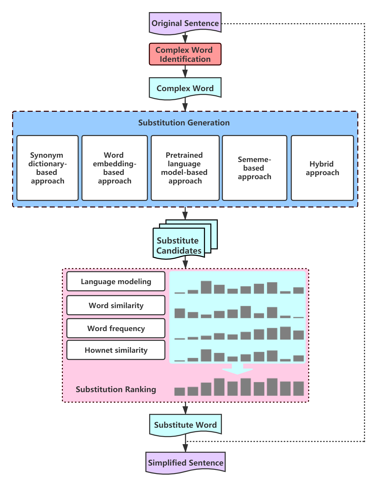

<p align="center"></p>

[English](README.md)|简体中文

## Chinese-LS是什么？

词简化 (Lexical Simplification) 是指将给定句子中的复杂词用更简单的替代词替换的过程. Chinese-LS（中文词简化系统）是中文词简化领域的首次尝试。在这里，我们提供了一个高质量的中文词简化[数据集](./dataset/annotation_data.csv)，可供模型训练或者是评估词简化的效果；同时，我们公开了五种中文词简化的基线方法，这些方法都拥有不错的准确率： 

- 基于同义词词典的方法

- 基于词向量相似度的方法

- 基于预训练语言模型的方法

- 基于义原的方法

- 混合方法

Chinese-LS的整体框架结构如下图所示:

<p align="center"></p>

## 快速上手

### 运行环境

- Python==3.7.6
- transformers==2.9.0
- numpy==1.18.1
- jieba==0.42.1
- torch==1.4.0
- OpenHowNet==0.0.1a11
- gensim==3.8.2

以上列出的仅仅为主要的依赖包及对应版本，你也可以直接```pip```/```conda```安装内含所有依赖的```requirements.txt``` 来完整复刻我们代码的运行环境。

### 运行前准备工作

#### 下载预训练模型

Chinese-LS使用了以下预训练模型:

- Word2Vec模型： [Chinese-Word-Vector](https://github.com/Embedding/Chinese-Word-Vectors) (Mixed-large)
- BERT-base, Chinese ([transformers](https://huggingface.co/bert-base-chinese)) 

下载完成后，请将模型文件存放至```./model```目录下。

### 运行

事实上，我们已经为你执行了所有的代码并已将中间结果保存至```./data```目录下，你可以通过阅读我们的论文：[Chinese Lexical Simplification](https://arxiv.org/abs/2010.07048)来了解代码和算法的细节。

如果你想要自己复现或者做一些修改，请按如下顺序执行代码：

#### 生成

1. 使用基于同义词词典的方法生成

	运行 ```dict_generate.py```
	
2. 使用基于词向量相似度的方法生成

	运行 ```vector_generate.py```

3. 使用基于预训练语言模型的方法生成

	运行```bert_generate.py```

4. 使用基于义原的方法生成

	Run ```hownet_generate.py```

5. 使用混合方法生成

	Run ```hybrid_approach.py```

#### 选择

运行 ```substitute_selection.py```

#### 排序

运行 ```substitute_ranking.py```

### 实验

Chinese-LS设计了5个实验来验证数据集的质量和比较各种方法，可以通过运行 ```experiment.py```查看具体实验数据。

## 引用

```
@article{qiang2020chinese,
  title={Chinese Lexical Simplification},
  author={Qiang, Jipeng and Lu, Xinyu and Li, Yun and Yuan, Yunhao and Shi, Yang and Wu, Xindong},
  journal={arXiv preprint arXiv:2010.07048},
  year={2020}
}
```

## 联系方式

Email: luxinyu12345@foxmail.com

## License

Chinese-LS is under the [Apache License, Version 2.0](https://github.com/luxinyu1/Chinese-LS/blob/master/LICENSE).